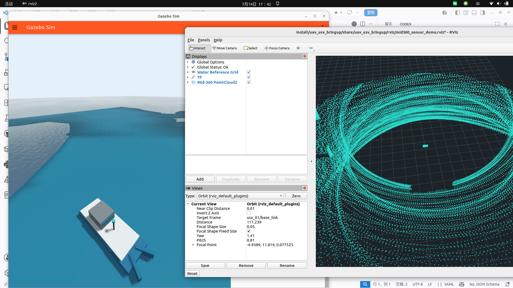

# uav_usv_perception

Ownership: perception and tracking team.

## Multi-source perception layer

The package now owns the ground-truth adapter, observation fusion, stable
track association, and the source mux that publishes the frozen mission input
`/fleet/perception/targets`. See
[`docs/PERCEPTION_ARCHITECTURE.md`](docs/PERCEPTION_ARCHITECTURE.md) and
[`docs/interfaces/TRACKED_OBJECT_CONTRACT.md`](docs/interfaces/TRACKED_OBJECT_CONTRACT.md).

```bash
ros2 launch uav_usv_perception perception_layer.launch.py \
  perception_source:=ground_truth
```

LV-DOT is not part of this launch. A future backend only needs to publish
`TrackedObjectArray` observations; it must not bypass fusion or the source mux.

## Mid-360 in the fleet capture system

The main fleet launch can attach the verified RGL Mid-360 sensor to the
existing `usv_01` model at runtime. The source world and USV model are not
rewritten: a generated model under `/var/tmp/UAV_USV_fleet_mid360` keeps the
original mass, collision geometry, wave follower, Nav2 interface, and velocity
controller, then adds only semantic frames, visual geometry, and the RGL custom
sensor. The CAD-style shell is built from SDF primitives and is not an official
Livox mesh.

```text
map -> odom -> usv_01/base_link -> usv_01/mid360_link
                                      |
                                      +-- raw PointCloud2
                                      +-- mid360_preprocessor
                                            +-- filtered PointCloud2
                                            +-- 2 Hz RViz preview
                                            +-- SensorStatus
```

### Main launch

```bash
cd /path/to/your/UAV_USV
source /opt/ros/humble/setup.bash
source install/setup.bash

# Full 3 UAV + 3 USV capture fleet with one Mid-360 per USV.
ros2 launch uav_usv_bringup fleet_dynamic_capture.launch.py \
  enable_mid360:=true mid360_visualize:=true

# Original fleet world and control graph, without any Mid-360 nodes or topics.
ros2 launch uav_usv_bringup fleet_dynamic_capture.launch.py \
  enable_mid360:=false
```

Main launch parameters:

| Parameter | Default | Effect |
| --- | --- | --- |
| `enable_mid360` | `true` | Generates sensor-equipped runtime models and starts each point-cloud pipeline. |
| `mid360_vehicle_ids` | `usv_01,usv_02,usv_03` | Comma-separated existing USVs that receive independent sensors. |
| `mid360_vehicle_id` | empty | Backward-compatible single-USV override. |
| `mid360_topic` | empty | Backward-compatible raw ROS topic override, valid only with one `mid360_vehicle_id`. |
| `mid360_update_rate` | `10.0` | RGL sensor update rate and expected health rate. |
| `mid360_visualize` | `true` | Starts the lightweight preview and selects the Mid-360 RViz config. |
| `mid360_min_range` | `0.5` | Minimum simulated and preprocessing range in metres. |
| `mid360_range` | `70.0` | Maximum simulated and preprocessing range in metres. |
| `mid360_voxel_size` | `0.12` | Filtered-cloud voxel size in metres; `0` disables voxel filtering. |
| `mid360_visual_scale` | `1.0` | Scales only the CAD-style sensor visuals; physics and scan geometry are unchanged. |
| `perception_source` | `ground_truth` | Reserved selector (`ground_truth`, `mid360`, `hybrid`); capture remains on ground truth in this stage. |
| `nav2_start_delay` | `20.0` | Starts the first Nav2 stack after the Gazebo, RGL, and PX4 startup peak. |
| `nav2_start_stagger` | `10.0` | Separates the two Nav2 lifecycle bringups to avoid service timeouts under load. |
| `rgl_install` | `/var/tmp/RGLGazeboPlugin/install` | RGL installation prefix. |
| `rgl_patterns` | `/var/tmp/RGLGazeboPlugin/lidar_patterns` | RGL scan-pattern directory. |

RGL's `Livox Mid360` preset reads its non-repetitive ray pattern from
`LivoxMid360.mat3x4f`. Horizontal and vertical sample counts are therefore not
exposed as launch parameters: changing them would replace the verified Mid-360
pattern with a generic raster scan. RGL 0.20 also does not expose a compatible
per-ray noise parameter for this preset, so no ineffective `noise_stddev`
option is advertised.

### Topics, frames, and health

| Interface | Type | Frame / purpose |
| --- | --- | --- |
| `/fleet/uplink/{usv_01..03}/mid360/points` | `sensor_msgs/msg/PointCloud2` | Raw RGL returns in the matching `{vehicle}/mid360_link`. |
| `/perception/{usv_01..03}/mid360/points_filtered` | `sensor_msgs/msg/PointCloud2` | Per-device NaN/Inf removal, range crop, own-ship crop, and voxel filtering. |
| `/perception/{usv_01..03}/mid360/preview` | `sensor_msgs/msg/PointCloud2` | Per-device, at most 2 Hz and 5000 points for RViz/GUI/Web display. |
| `/fleet/sensor_status` | `uav_usv_interfaces/msg/SensorStatus` | Rate, age, latency, point count, drops, processing time, and health. |
| `/perception/usv_01/mid360/set_visualization` | `std_srvs/srv/SetBool` | Enables/disables only the preview; filtered data remains available. |

The USV Nav2 stack publishes its moving transform on `/usv_01/tf`. A read-only
relay exposes that transform on global `/tf`; the sensor mount itself is a
static `usv_01/base_link -> usv_01/mid360_link` transform. Point coordinates
are never rewritten to compensate for missing TF.

Useful checks:

```bash
ros2 topic hz /fleet/uplink/usv_01/mid360/points
ros2 topic bw /fleet/uplink/usv_01/mid360/points
ros2 topic echo /fleet/sensor_status \
  --filter "m.vehicle_id == 'usv_01' and m.sensor_id == 'mid360'" --once
ros2 run tf2_ros tf2_echo map usv_01/mid360_link
ros2 service call /perception/usv_01/mid360/set_visualization \
  std_srvs/srv/SetBool "{data: false}"
```

The Qt console subscribes only to `SensorStatus`. It displays the frame, TF
availability, rate, latency, filtered point count, drop count, and processing
time, and calls the preview service from its display toggle. It never decodes
the full-rate cloud on the Qt thread.

### Full-fleet measurement (2026-07-14)

Test host: ROS 2 Humble, Gazebo Harmonic 8.14, RTX 4060 Laptop GPU, four PX4
SITL instances, two Nav2 USVs, six cameras, and the moving enemy target.

- Raw cloud: 9.86 Hz, about 2.8k valid returns per frame.
- Raw ROS bandwidth: 434 KB/s; mean message size 44 KB.
- Filter processing: 3.7-5.8 ms per frame in the tested scene.
- Preview: 1.85-1.97 Hz when enabled.
- Sensor health: online, valid wall-clock timestamp, about 7-11 ms latency.
- Enabled RTF after loading: average 0.94 over an 8 s window; typical samples
  were near 1.0, with transient GUI/rendering stalls.
- Bridge and preprocessor: each about 7% of one CPU core during measurement.
- Disabling Mid-360 removes all Mid-360 nodes/topics and returns its ROS
  bandwidth to zero.

Gazebo GUI camera motion and window visibility make instantaneous GPU and RTF
comparisons noisy. In the captured runs GPU utilization ranged from 5-8% with
Mid-360 and 32-33% without it because the GUI rendered different views; those
figures are recorded rather than interpreted as sensor overhead. For repeatable
profiling, use a fixed camera pose and sample over a longer interval.

The complete capture regression reached `SUCCESS`: all four UAVs armed,
entered Offboard, took off, and accepted assignments; both USVs executed Nav2
goals. In the final cold-start regression, `usv_01` moved from approximately
`(-16, 2)` to `(-10.4, 30.1)` in `map`, while the raw cloud remained near
9.7 Hz and the filtered cloud near 9.3 Hz. A separate simultaneous two-USV
motion test moved `usv_01` about 14.4 m and `usv_02` about 14.4 m without
interrupting the Mid-360 stream.

## Standalone Harmonic sensor demo

The standalone demo publishes a standard ROS 2 point cloud without changing
the capture mission, fleet commands, PX4 agents, USV control, or Qt logic.

```text
map -> odom -> usv_01/base_link -> usv_01/mid360_link
                                     |
                                     +-- /usv_01/mid360/points
                                         sensor_msgs/msg/PointCloud2
```

### Why RGL is the preferred backend

The official `Livox-SDK/livox_laser_simulation` plugin targets ROS Melodic and
Gazebo Classic 9. It cannot be loaded directly by Gazebo Harmonic. The official
`livox_ros_driver2` supports ROS 2 Humble and Mid-360 hardware, but it is a
hardware driver rather than a Gazebo sensor plugin.

The demo uses RobotecAI RGLGazeboPlugin with its `Livox Mid360`
non-repetitive scan preset. RGL is a Harmonic-native NVIDIA/OptiX plugin and
publishes `gz.msgs.PointCloudPacked`, which is normalized to this ROS interface:

```text
/usv_01/mid360/points  sensor_msgs/msg/PointCloud2
frame_id               usv_01/mid360_link
frequency              10 Hz
```

### Install RGL

RGL is kept outside this repository so third-party binaries and the large scan
pattern dataset do not pollute the workspace.

```bash
git clone --depth 1 --branch v0.2.0-harmonic \
  https://github.com/RobotecAI/RGLGazeboPlugin.git \
  /var/tmp/RGLGazeboPlugin

cmake -S /var/tmp/RGLGazeboPlugin \
  -B /var/tmp/RGLGazeboPlugin/build \
  -DCMAKE_BUILD_TYPE=Release \
  -DCMAKE_INSTALL_PREFIX=/var/tmp/RGLGazeboPlugin/install

cmake --build /var/tmp/RGLGazeboPlugin/build -j4
cmake --install /var/tmp/RGLGazeboPlugin/build
```

The tested machine uses Gazebo 8.14, an RTX 4060 Laptop GPU, and NVIDIA driver
535.309.01. RGL reports CUDA runtime 11.7 and OptiX ABI 41.

### Build and run

```bash
cd /path/to/your/UAV_USV
source /opt/ros/humble/setup.bash
colcon build --packages-select \
  uav_usv_gazebo uav_usv_perception uav_usv_bringup \
  --symlink-install
source install/setup.bash

ros2 launch uav_usv_bringup mid360_sensor_demo.launch.py
```

Useful launch parameters:

```text
start_gazebo:=true|false
start_rviz:=true|false
move_usv:=true|false
linear_speed:=0.8
angular_speed:=0.035
rgl_install:=/path/to/RGLGazeboPlugin/install
rgl_patterns:=/path/to/RGLGazeboPlugin/lidar_patterns
```

### Verification

```bash
ros2 topic list -t | grep mid360
ros2 topic hz /usv_01/mid360/points
ros2 topic echo /usv_01/mid360/points --once --field header
ros2 run tf2_ros tf2_echo map usv_01/mid360_link
ros2 run tf2_tools view_frames
```

Measured with the RGL backend and Gazebo GUI running:

- Point cloud rate: 9.99 to 10.01 Hz.
- Point bridge CPU: about 11% of one CPU core.
- Gazebo server CPU: about 19% of one CPU core.
- GPU utilization: about 27%.
- GPU memory: about 1.25 GB including Gazebo rendering.

RGL publishes only valid returns, so `PointCloud2.width` changes with the
scene. The fields are `x`, `y`, `z`, and `intensity`. The current public
interface does not expose Livox `CustomMsg`, per-point relative time, or IMU;
algorithms requiring those fields need a later adapter. LV-DOT is intentionally
not connected in this stage.



Expected outputs:

- `/maritime/tracks/lidar`
- `/maritime/tracks/camera`
- `/maritime/tracks/ais`
- `/maritime/tracks/fused`

All outputs use `uav_usv_interfaces/TrackedObjectArray`. The current AIS simulator remains in `uav_usv_sim` until migration.

## LV-DOT Shadow Mode

The ROS 1 LV-DOT backend is kept in an isolated container. Its output is
adapted to `TrackedObjectArray` and compared with Gazebo ground truth without
changing the capture mission input. See
[`docs/LV_DOT_SHADOW_MODE.md`](docs/LV_DOT_SHADOW_MODE.md).
The latest measured validation is recorded in
[`docs/LV_DOT_SHADOW_TEST_2026-07-15.md`](docs/LV_DOT_SHADOW_TEST_2026-07-15.md).
The real-target tuning workflow, stage diagnostics, and current validation
status are recorded in
[`../../docs/LV_DOT_TUNING_REPORT.md`](../../docs/LV_DOT_TUNING_REPORT.md).
